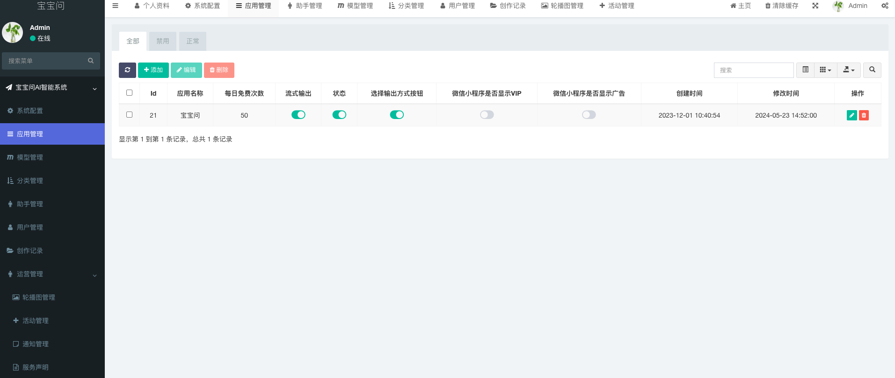
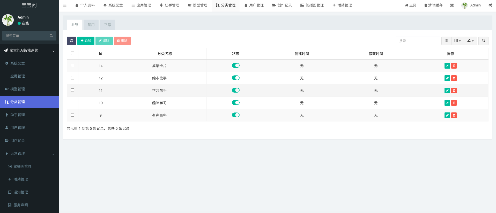
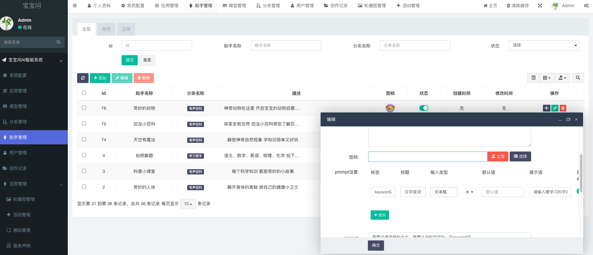
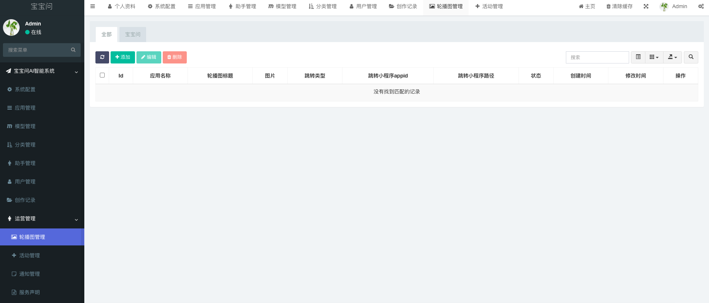
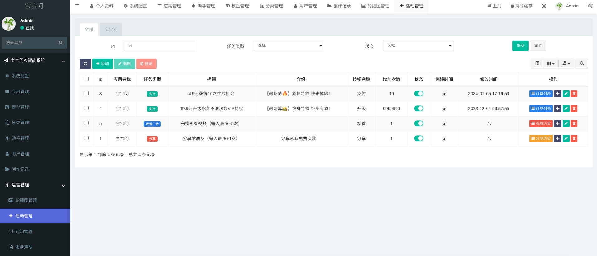
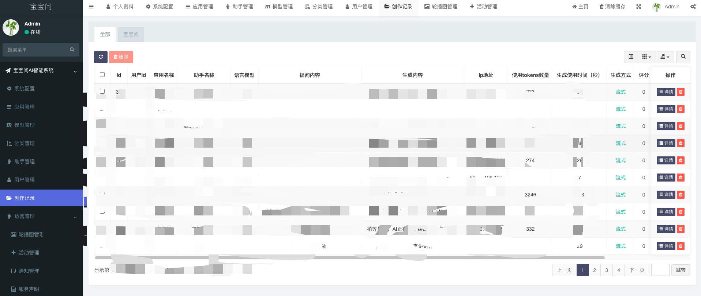

## coze2wechatmp
### 介绍
coze-api的ai问答微信小程序，聚合coze多智能体于私有化小程序，基于php+uniapp开发，目的是基于各大AI大语言模型API实现的AI助手微信小程序端解决方案，目前集成coze-api以及其他AI大语言模型预留标准接入流程，微信接口安全审核机制。

### 功能特性
* 包含uniapp前端应用和后台管理系统。
* 适配coze-api，支持文本输出、多模态输出，标准化接口接入流程，可接入其他AI大语言模型。
* 支持微信支付、激励视频广告等商业化能力。
* 后台系统底层设计为SAAS，后台可创建多个小程序渠道搭建。
* 支持一次性回复、流式回复等。

### 运行环境
```
nginx
php7.4
mysql8.0
redis
```

### 目录结构
backend ---- 服务端

---- application/admin 后台管理系统    
---- application/api 服务端 api 接口

frontend ---- uniapp微信小程序

### 小程序演示


### 后台功能截图






